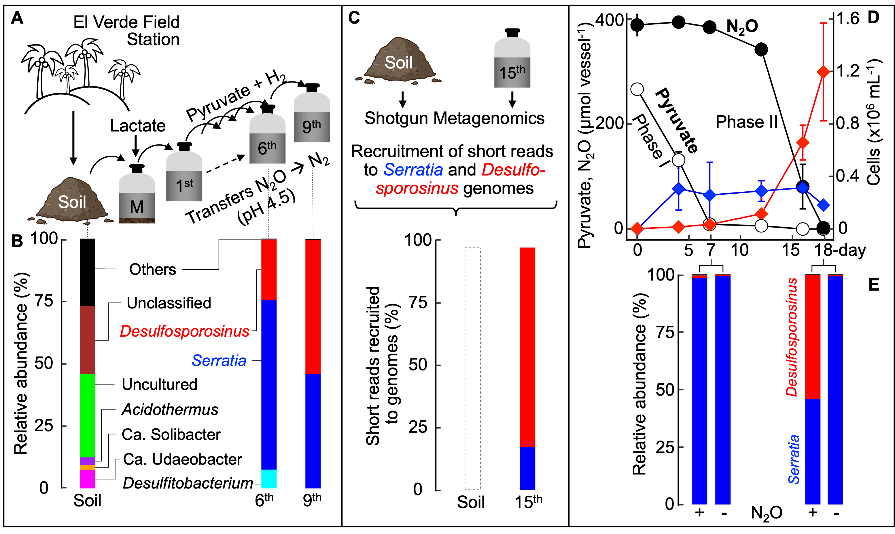
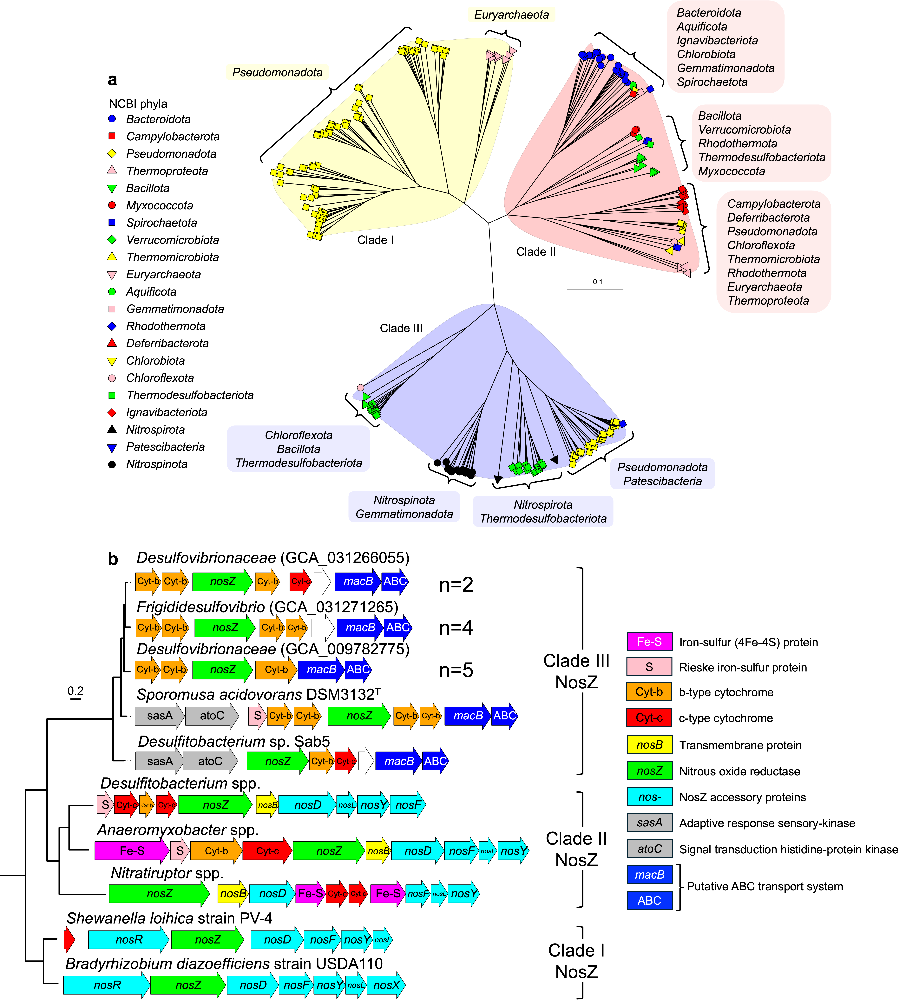

## Research Overview

My research explores microbial processes regulating greenhouse gas fluxes and nutrient cycling. I integrate microbiology with omics and modeling to uncover novel microbial traits and ecosystem functions.

------------------------------------------------------------------------

## 🧫 Cultivate Fastidious Microorganisms

::::: {style="display: flex; align-items: flex-start; gap: 2rem; margin-top: 1rem; flex-wrap: wrap;"}
<!-- LEFT COLUMN: IMAGE + CAPTION -->

::: {style="flex: 1; min-width: 280px;"}
{alt="Enrichment Culturing Setup" style="border-radius: 10px; box-shadow: 0 2px 6px rgba(0,0,0,0.1);"}

Enrichment Culturing Setup in Nat. Commons., 2024

:::

<!-- RIGHT COLUMN: TEXT -->

::: {style="flex: 1; min-width: 300px;"}
**Objective**\
Cultivate and characterize fastidious microorganisms by combining targeted enrichment culturing with multi-omics approaches.

**Approach**\
- Anaerobic and microoxic culture systems mimicking natural niches\
- Use of selective substrates and redox conditions\
- Integration of metagenomics, transcriptomics, and proteomics\
- Genome-informed media design for cultivation and phenotyping

**Significance**\
Reveals novel N₂O-reducing lineages and their role in denitrification under extreme conditions, bridging lab cultivation with environmental function.
:::
:::::

------------------------------------------------------------------------

::: {style="margin-top: 6rem;"}
:::

## 🔬 Identify Novel Microbial N₂O Sinks

::::: {style="display: flex; align-items: flex-start; gap: 2rem; margin-top: 1rem; flex-wrap: wrap;"}
<!-- LEFT COLUMN: IMAGE + CAPTION -->

::: {style="flex: 2; min-width: 280px;"}
{alt="Enrichment Culturing Setup" style="border-radius: 10px; box-shadow: 0 2px 6px rgba(0,0,0,0.1);"}

Identification of clade III NosZ in Nature, 2025

:::

<!-- RIGHT COLUMN: TEXT -->

::: {style="flex: 1; min-width: 300px;"}
**Objective**\
To uncover unknown microbial contributors to N₂O consumption by integrating physiological evidence with comparative genomics and functional screening.

**Background**\
This project was initiated by an unexpected observation: complete N₂O removal by microbial communities lacking known *nosZ* clades. This inconsistency between experimental results and genomic predictions prompted deeper exploration of alternative or novel N₂O reductases.

**Significance**\
This research expands our understanding of microbial N₂O sinks beyond canonical *nosZ*-based denitrification, offering insights into dark matter microbiomes and potential bioaugmentation strategies for climate-smart soils and aquatic systems.
:::
:::::
